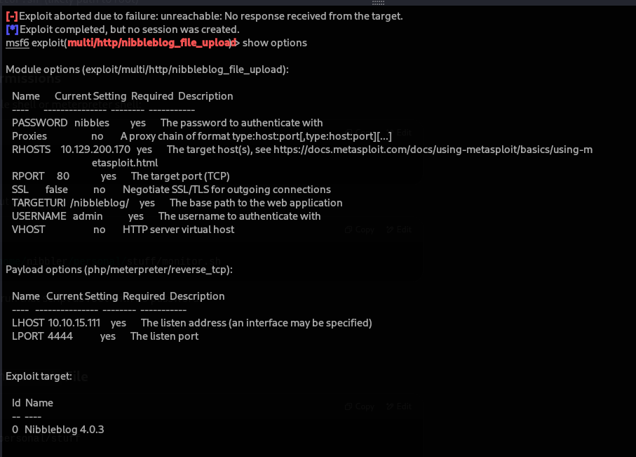

# 🧪 Lab Challenges & CTFs

## ⚔️ Hack The Box – Nibbles

**Problem:** Gain initial foothold on a Linux web server.  
**Tools Used:** DirBuster, netcat, SSH  
**Approach:**  
- Discovered an unlisted `/nibbleblog/` directory  
- Exploited outdated CMS to upload a shell  
- Gained root via privilege escalation using SUID

**Screenshot:**  

**Key Lessons:**  
- Importance of directory brute-forcing  
- Working with public exploits responsibly  
- Privilege escalation enumeration

---

## 🔐 CyberShujaa Challenge: Open Port Exploitation

**Problem:** Access a misconfigured service via open port  
**Tools:** Nmap, Telnet, Netcat  
**Approach:**  
- Scanned for unusual open ports  
- Connected via Netcat and reverse-engineered banner  
- Extracted credentials and accessed system

**Key Takeaways:**  
- Network scanning precision  
- Reading service responses  
- Thinking creatively with common tools
